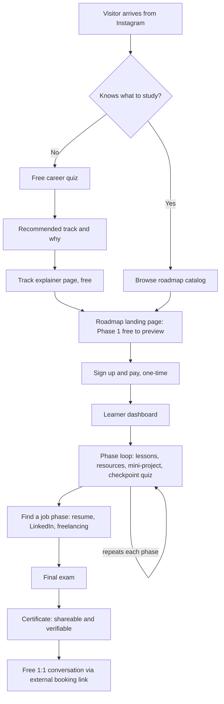
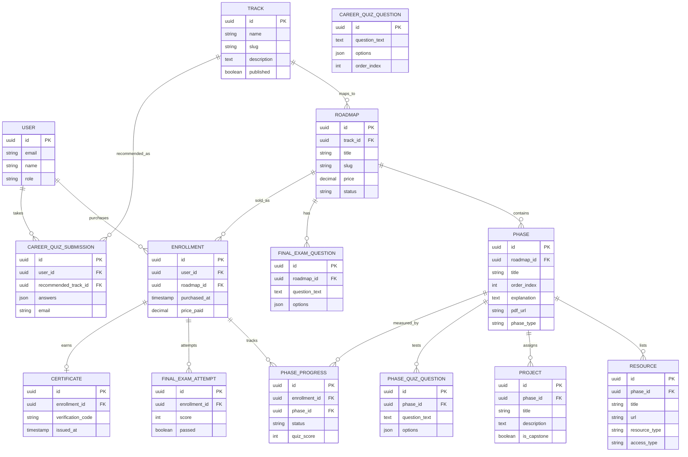
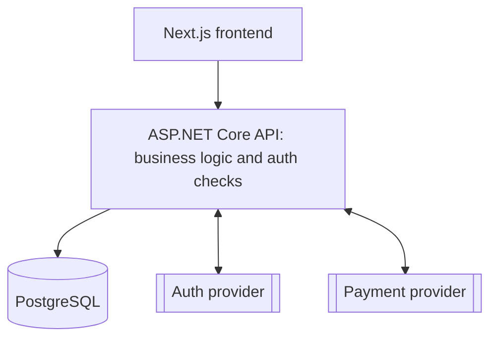

# Arabic IT roadmaps platform — project specification

> **Note for Claude Code:** This document is a complete requirements and design brief for a project we are building from zero. Read it in full before writing any code. Once you've read it, summarize your understanding back to us and ask about anything ambiguous, missing, or contradictory. We will confirm scope together first. Only after that confirmation do we begin, starting with Slice 0 in section 14.

## Table of contents

1. [Project overview](#1-project-overview)
2. [Scope](#2-scope)
3. [Actors](#3-actors)
4. [User scenarios](#4-user-scenarios)
5. [User flow diagram](#5-user-flow-diagram)
6. [Data model (ERD)](#6-data-model-erd)
7. [System architecture](#7-system-architecture)
8. [API surface](#8-api-surface)
9. [Tech stack](#9-tech-stack)
10. [UI direction: Study calm](#10-ui-direction-study-calm)
11. [Content model details](#11-content-model-details)
12. [Engineering standards](#12-engineering-standards)
13. [Open decisions](#13-open-decisions)
14. [Suggested build order](#14-suggested-build-order)

---

## 1. Project overview

The founder is a network and CCTV engineer transitioning into software engineering, self-taught in .NET, who has built an Arabic-language IT and software-engineering education audience on Instagram (roughly 8,000 followers, `@ahmadaalhaj`). One free post explaining software engineering, ending in a free roadmap PDF, generated about 90 direct requests — real validation of demand for structured learning content in Arabic.

**The product:** a platform where Arabic-speaking learners pay once per roadmap to follow a structured, phase-by-phase learning path (e.g. Software Engineering, Ethical Hacking, Frontend Development), with curated resources, hands-on projects, and checkpoints, ending in a certificate.

**The actual moat is not the roadmap concept** — free equivalents already exist in English (roadmap.sh, freeCodeCamp) and are excellent. The moat is the founder's existing trusted Arabic-speaking audience combined with an Arabic-first, beginner-friendly execution nobody else has built well. Curation, sequencing, original explanation, and project design are the real product; the topic lists themselves should lean on already-solved, free, community-vetted curricula (roadmap.sh, freeCodeCamp, university syllabi like CS50 or MIT OCW) rather than being invented from scratch.

**Business model:** one-time payment per roadmap, lifetime access. Not a subscription in v1.

**Dual goal:** this is a revenue product AND a portfolio-quality engineering project for the founder's own career growth. It should be built the way a professional team would build it — secure, reliable, maintainable, testable — not vibe-coded. The founder is a working developer and wants to understand and be able to explain every part of this system, not just ship it.

## 2. Scope

### In v1

- Arabic only, right-to-left (RTL) layout throughout
- One roadmap live at launch (Software Engineering — the one already validated), but the data model and admin tooling support many roadmaps and tracks from day one
- A free "career compass" feature: track explainer pages plus a short quiz that recommends a track, for visitors who don't yet know what to study
- The full phase structure described in section 11
- One-time payment per roadmap
- An admin CMS so all content (roadmaps, phases, resources, quiz questions) is authored through the app, never hardcoded
- Certificates with public, shareable verification pages
- A manual, external perk: a free 1:1 conversation with the founder, offered after roadmap completion

### Explicitly deferred — do not build these in v1, flag it if asked to add scope here

- A mobile app
- Any in-app community or discussion feature (an external Telegram group covers this for now — building a real community is expensive and should wait until the product is profitable)
- Self-hosted video (all video resources are embedded links, e.g. YouTube — never re-hosted)
- Any language other than Arabic
- Any AI-powered feature anywhere in the product, including the career quiz — quiz scoring must be simple, transparent, rule-based weighted scoring, not an LLM call
- An affiliate program for paid resources (a real future opportunity, not something to wire up now)
- Subscription billing

## 3. Actors

- **Visitor** — anonymous, can browse free content and take the career quiz
- **Learner** — has an account and at least one enrollment (a purchased roadmap)
- **Admin** — the founder; authors content and reviews analytics

## 4. User scenarios

### 4.1 The undecided visitor (career compass)

A visitor who doesn't know what to study can read track explainer pages (one per major, e.g. Frontend, Backend, Cybersecurity, Cloud, Data/AI), each covering what the work looks like day to day, the mindset it rewards, the learning curve, and the job market — written in the founder's own voice, and free with no login required. These pages also double as SEO landing pages.

Alternatively, the visitor can take a short quiz (8–12 multiple-choice questions on things like visual vs. logic-driven work, structured data vs. investigative thinking, hours available per week). Each answer option carries a weight toward each track; the system sums weights and shows the top 1–2 recommended tracks with a short "why this fits" explanation, linking to that track's free page.

Whether viewing the quiz result requires an email address first is an open decision (section 13). Quiz submissions are stored (with the recommended track and, if given, an email) so the admin can see quiz-recommendation-to-purchase conversion per track.

### 4.2 Buying a roadmap

Whether arriving via the quiz, a track page, or the roadmap catalog directly, a visitor lands on a roadmap's landing page showing the full phase outline (titles visible), the price, and a "buy" button. **Phase 1 is fully open as a free sample** — readable and usable without paying, as an honest preview of the real product.

Buying creates an account (email/password or a social login) and a one-time payment. On successful payment, the roadmap unlocks permanently for that learner.

### 4.3 The learning loop

Once enrolled, the learner works through phases in order from their dashboard, which always resumes at "continue where you left off." Each phase (see section 11 for the full structure) ends with a checkpoint quiz; passing it — not just viewing the content — is what marks the phase complete.

After all technical phases, a dedicated **"Find a job"** phase covers resume writing, LinkedIn, and freelancing/selling your own work — structured the same way as a technical phase, but with career content instead. After that comes a roadmap-wide **final exam**. Passing it issues a **certificate** (unique verification code, public verification page, shareable). Certificate issuance also unlocks a link (Calendly-style booking or an email address — not an in-app chat feature) to book a **free 1:1 conversation** with the founder. This is a deliberately manual, unscalable v1 growth tactic, expected to be capped or retired once volume makes it impractical.

### 4.4 Admin

The founder creates and edits roadmaps, tracks, phases, resources, and quiz questions entirely through admin screens — no direct database edits or redeploys to change content. Roadmaps can be draft or published. The admin view shows sales, learner counts, per-phase completion rates (to see where learners get stuck), and quiz-recommendation-to-purchase conversion per track.

## 5. User flow diagram

## 6. Data model (ERD)

**Deliberate design choice:** quiz options (for the career quiz, phase checkpoint quizzes, and the final exam) are stored as a JSON column on the question row rather than a fully normalized options table. This is simpler to build and Postgres handles it natively. If per-option analytics become valuable later (e.g. which wrong answer people pick most), that is a clean additive migration — not a reason to over-normalize now.

## 7. System architecture

Two supporting pieces sit alongside this without being architecturally significant enough for their own boxes: blob storage for the per-phase PDF uploads, and a transactional email service for welcome emails and certificate notifications.

## 8. API surface

**Public**
- `GET /api/tracks`, `GET /api/tracks/{slug}`
- `GET /api/roadmaps`, `GET /api/roadmaps/{slug}`
- `GET /api/quiz/questions`, `POST /api/quiz/submit`
- `GET /api/certificates/{code}` — public verification page

**Learner (authenticated)**
- `POST /api/roadmaps/{id}/checkout`
- `GET /api/me/enrollments`
- `GET /api/enrollments/{id}`
- `POST /api/phases/{id}/complete` — validates the checkpoint quiz score server-side before marking progress
- `POST /api/roadmaps/{id}/final-exam/submit`

**Admin (role-gated)**
- Full CRUD on `/api/admin/tracks`, `/api/admin/roadmaps`, `/api/admin/phases`, `/api/admin/resources`, `/api/admin/quiz-questions` (used for both phase checkpoints and the final exam)
- `POST /api/admin/phases/{id}/pdf` — file upload
- `GET /api/admin/analytics`

**Webhook**
- `POST /api/webhooks/payment` — server-to-server purchase confirmation. Never trust a client-reported payment status; enrollment is only created after this webhook confirms payment.

## 9. Tech stack

- **Backend:** ASP.NET Core Web API (C#), EF Core
- **Database:** PostgreSQL
- **Frontend:** Next.js (React, TypeScript), Tailwind CSS
- **Auth:** a managed provider — exact choice open, see section 13. Do not roll a custom auth system.
- **Payments:** a merchant-of-record provider (Paddle or Lemon Squeezy preferred, for built-in VAT/tax handling since sales cross borders from the UAE) — exact choice open, see section 13
- **Hosting:** API and database on Railway, Render, or Azure App Service; frontend on Vercel
- **File storage:** blob storage (Azure Blob or S3-compatible) for phase PDFs
- **Email:** a transactional email provider for welcome and certificate notifications

## 10. UI direction: Study calm

Chosen from three explored directions. The goal is a calm, focused, trustworthy "study companion" feel — less flashy than a typical gamified app, more suited to sitting down and concentrating.

- **Accent colors:** primary interactive accent `#0F6E56` (buttons, primary actions); lighter teal `#1D9E75` for text accents, icons, and progress indicators
- **Corner radius:** modest — 8px on cards, 6–8px on buttons and inputs. Deliberately less rounded than a playful/gamified style
- **Progress representation:** a circular ring or plain percentage rather than a segmented bar or streak-style gamification — reinforces individual pace over competition
- **Resource lists:** minimal — no colored background fill per row, thin dividers between items, muted (not accent-colored) icons, to keep visual noise low
- **Typography rhythm:** generous line-height (~1.7) on explanation and body text — this is a reading-heavy educational product
- **Spacing:** generous whitespace throughout; avoid dense, cramped layouts
- **RTL:** all content is Arabic. Every layout must mirror correctly right-to-left — this affects icon placement, text alignment, and flex-direction everywhere, not just body text, and should be treated as a first-class constraint from the first component built, not retrofitted later

This is a strong starting direction agreed on together, not an unchangeable law — real screens will surface edge cases worth adjusting. Brand accents (the founder's existing orange, `#E8764A`, used on Instagram) could still appear on marketing/landing pages even though the in-app learning experience uses teal, if that distinction is wanted later.

## 11. Content model details

Every phase (`phase_type = "standard"`) contains:

1. A short "why this matters" explanation, written in the founder's own voice
2. A resource list mixing free and paid third-party resources (video, article, documentation, or course), each tagged by type and access (free/paid)
3. A mini-project with clear requirements
4. A checkpoint quiz — passing it, not just viewing the content, is what marks the phase complete. Default policy: unlimited retries, no cooldown, since the goal is learning, not gatekeeping
5. A downloadable PDF covering the phase from A to Z, plus "best practices" and mindset guidance (e.g. why coding cannot be learned by only watching someone else do it)

The final phase before the exam, `phase_type = "find_a_job"`, follows the same five-part structure but with career content: resume writing, LinkedIn, and freelancing or selling your own work as a service.

After all phases: one roadmap-wide final exam, then certificate issuance, then the free 1:1 conversation unlock described in section 4.3.

All of this content is authored through the admin CMS — nothing is hardcoded. Content quality approach: use existing, free, community-vetted curricula as the topic skeleton (see section 1) rather than inventing topic lists from scratch; validate early phases with a small beta group before publishing later phases; get at least one outside technical review pass per roadmap before publishing.

## 12. Engineering standards

- **Security:** never build custom authentication. Validate payment confirmations server-side via webhook only. Role-based access control gates every `/admin` endpoint.
- **Reliability:** automated database backups; a staging environment separate from production; structured logging (e.g. Serilog) and error monitoring (e.g. Sentry).
- **Testing:** unit tests on anything touching money or access control (entitlement checks, payment webhook handling, quiz-pass gating before marking a phase complete); integration tests on API endpoints.
- **CI:** automated build and test on every push.
- **Code quality:** this project is also the founder's own .NET learning capstone and a portfolio piece. Favor clear, conventional, explainable code over clever shortcuts. Every merged line should be something the founder could explain, unaided, in a technical interview.

## 13. Open decisions

Not yet resolved. Do not silently assume an answer — ask, or flag clearly if a choice must be made to proceed.

- Final price point per roadmap
- Exact payment provider
- Exact auth provider
- Product/brand name and domain
- Strict vs. soft phase locking (soft-lock — warn but don't block — is the current recommendation)
- Whether viewing a career quiz result requires an email address first

## 14. Suggested build order

A vertical-slice sequence — each slice should be small, working, and demoable end to end before moving to the next. Confirm this order together before starting Slice 0.

0. **Repo and deploy skeleton** — .NET solution structure, Next.js app, Postgres connection, CI (build + test on push), a health-check endpoint, deployed to staging. Nothing user-facing yet.
1. **Auth skeleton** — provider integrated, one protected endpoint, login/logout UI working end to end.
2. **Free preview read path** — one seeded roadmap, one seeded phase, viewable on the roadmap landing page and the phase view with no payment required (this doubles as building the real "Phase 1 free preview" feature).
3. **Admin authoring, minimal** — the create/edit phase screen, so content comes from the CMS instead of hand-seeded data.
4. **Payment and enrollment** — provider integrated, checkout flow, webhook handling, enrollment creation, phases 2+ unlocking after purchase.
5. **Progress and checkpoint quizzes** — passing a quiz marks a phase complete; progress persists; "continue where you left off" works.
6. **Final exam and certificate** — roadmap-wide exam, certificate generation, public verification page.
7. **Career compass** — track pages, the quiz, scoring, and the recommendation-to-track-page link.
8. **Admin analytics** — completion rates per phase, quiz-to-purchase conversion.
9. **Remaining content features** — the Find a job phase, PDF resource uploads, the 1:1 conversation booking link.
